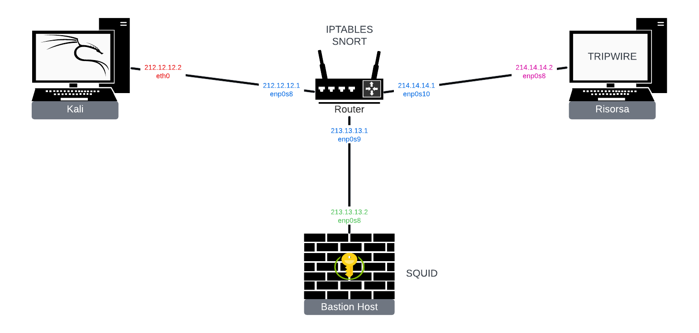

# Advanced Cybersecurity for IT

Il progetto "Infrastruttura Sicura" nasce dalla necessità di creare un ambiente di rete sicuro e resistente alle minacce informatiche. Utilizzando VirtualBox, abbiamo configurato un laboratorio virtuale composto da quattro macchine: tre con Debian 11 e una con Kali Linux. L'obiettivo è sviluppare e testare strategie di difesa contro attacchi informatici in un contesto controllato.

In questo setup, una delle macchine Debian funge da "risorsa critica", ovvero il target principale da proteggere. Le altre due macchine Debian agiscono come supporto, implementando varie misure di sicurezza per difendere la risorsa critica. Kali Linux, noto per i suoi strumenti di penetration testing, è utilizzato per simulare attacchi contro l'infrastruttura, permettendo di testare l'efficacia delle difese messe in atto.

L'idea è di creare un modello di infrastruttura che sia non solo sicuro, ma anche resiliente, adattandosi e rispondendo efficacemente a vari tipi di minacce. Questo progetto serve come campo di prova per strategie di sicurezza, offrendo un ambiente realistico per l'apprendimento e il miglioramento delle competenze in ambito di sicurezza informatica.

In sintesi, l'obiettivo principale è la creazione di un ambiente in cui le connessioni non autorizzate vengano prontamente rifiutate, mentre qualsiasi tentativo di accesso non autorizzato venga tempestivamente individuato e notificato al sistema di sicurezza.

## CONFIGURAZIONE DELLE VM

Creare 4 macchine virtuali
Abbiamo usato:
- Debian 11 per il Router
- Debian 12 per Risorsa e Bastion Host
- Kali per come macchina esterna

Per il Router inserire 4 schede di rete: 1 NAT, le altre 3 con Rete Interna 
(abilitando la modalità promiscua nella Inerfaccia di rete che si collega a Risorsa e Bastion Host)

Per le altre 3 Macchine virtuali inserire 2 schede di rete: 1 NAT, e 1 Rete Interna. Questo descritto dalla tabella sottostante:

| Mode  	| VM -> Host | VM <- Host | VM1 <-> VM2 | VM -> Net/LAN | VM <- Net/LAN |
| ------------- | :--------: | :--------: | :---------: | :-----------: | :-----------: |
| Host-only  	| + | + | + | - | - |
| Internal  	| - | - | + | - | - |
| Bridged  	| + | + | + | + | + |
| NAT  		| + | Port forward | - | + | Port forward |
| NATservice  	| + | Port forward | + | + | Port forward |

Nella tabella: 
- "+" indica che la comunicazione è possibile. 
- "-" indica che la comunicazione non è possibile. 
- "Port forward" indica che è possibile inoltrare specifiche porte dalla macchina host alla VM.

L'immagine sottostante descrive la configurazione della nostra infrastruttura:

Aprire le VM, per vedere quali reti sono presenti digitare il comando sul terminale `ip a` oppure `ifconfig`. 
- per Risorsa e Bastion Host si avrà `enp0s3` per la NAT e `enp0s8` per la Rete Interna
- per Kali si avrà `eth0` per la Rete Interna
- per Router si avrà `enp0s3` per la NAT e `enp0s8`, `enp0s9`, `enp0s10` per le Reti Interne

successivamente, digitale il comando:

	sudo nano /etc/network/interfaces
 
questo ci permette di configurare le nostre interfacce di rete con indirizzi che vogliamo assegnare noi

-per Kali aggiungere sotto le seguenti righe:

	auto eth0
	iface eth0 inet static
		address 212.12.12.2
		gateway 212.12.12.1
		
-per Bastion Host aggiungere sotto le seguenti righe:

	auto enp0s8
	iface enp0s8 inet static
		address 213.13.13.2
		gateway 213.13.13.1

-per Risorsa aggiungere sotto le seguenti righe:

	auto enp0s8
	iface enp0s8 inet static
		address 214.214.214.2
		gateway 214.214.214.1
		
-per Router aggiungere sotto le seguenti righe:

	#Kali
	auto enp0s8
	iface enp0s8 inet static
		address 212.12.12.1
	
	#Bastion Host
	auto enp0s9
	iface enp0s9 inet static
		address 213.13.13.1

	#Risorsa
	auto enp0s10
	iface enp0s10 inet static
		address 214.14.14.1

Dopo aver salvato le varie il file interfaces, digitare il seguente  comando per ognuna delle VM:

	sudo systemctl restart networking
	
Inoltre soltanto nel router impostare il comando per abilitare il forwarding dei pacchetti di rete tra le macchine:

	sudo sysctl -w net.ipv4.ip_forward=1
 
Per verificare se il comando precedente sia attivo si può digitare:

	sudo cat /proc/sys/net/ipv4/ip_forward

Per vedere la tabella di routing usa

	sudo ip route show
 
Per pulire la tabella di routing usa

	sudo ip route flush table all
	
Sempre in Router impostare il traffico tra Risorsa e Kali, digitando:

	sudo ip route add 214.14.14.0/24 via 212.12.12.1 dev enp0s8

Puoi fare il ping dalle varie VM digitando il seguente commento:

	ping <indirizzo_VM_destinazione> -c2 -R
	
Se hai riavviato la VM , potrebbe non funzionare internet, una delle soluzioni è andare a modificare il file resolv.conf, digitando:

	sudo nano /etc/resolv.conf
 
se c'è scritto 'nameserver 192.168.1.1', cancellare questa riga e scrivere:

	nameserver 8.8.8.8
	nameserver 8.8.4.4
 
salvare e tornare al terminale.

## IPTABLES

	

Successivamente digitare i seguenti comandi, che sono 3 regole dove si rifiuta la comunicazione con tutte e tre le interfacce di rete del Eouter come destinatario:

	sudo iptables -I INPUT -s 212.12.12.2 -j DROP -d 212.12.12.1
	sudo iptables -I INPUT -s 212.12.12.2 -j DROP -d 213.13.13.1
	sudo iptables -I INPUT -s 212.12.12.2 -j DROP -d 214.14.14.1
	
Poi, nella catena di FORWARD si inseriscono le regole per tutti i pacchetti in transito nel router e non destinati direttamente ad esso, stabiliamo quindi di scartare tutti i pacchetti destinati direttamente alla Risorsa e al Bastion Host:

	sudo iptables -A FORWARD -s 212.12.12.2 -j DROP -d 214.14.14.2
	sudo iptables -A FORWARD -s 212.12.12.2 -j DROP -d 213.13.13.2
	
Poi, le successive regole sono invece inserite in testa alla catena (opzione -I), e consentono di stabilire connessioni tcp stateful, nel quale si tiene conto anche del continuo cambio di porte per la connessione:

	sudo iptables -I FORWARD -s 213.13.13.2 -d 212.12.12.2 -p tcp -m conntrack --ctstate NEW,ESTABLISHED,RELATED -j ACCEPT
	sudo iptables -I FORWARD -s 212.12.12.2 -d 213.13.13.2 -p tcp -m conntrack --ctstate NEW,ESTABLISHED,RELATED -j ACCEPT

Per prevenire l'IP spoofing, abbiamo implementato regole che assicurano che l'indirizzo IP di una macchina non venga falsificato:

	sudo iptables -A INPUT -i enp0s10 -s 214.14.14.2 -j ACCEPT
	sudo iptables -A INPUT -i enp0s10 ! -s 214.14.14.2 -j DROP

		
Per vedere il risultato finale digitare:

	sudo iptables -L -n -v
	
È bene salvare le configurazioni impostate su IpTables su file con il comando

	sudo /sbin/iptables-save > /home/debian/Documents/iptables_rule
 
Dopo aver resettato le regole con il comando

	sudo iptables –F
 
è possibile ripristinare la configurazione salvata su `iptables_rule` con il comando:

	/sbin/iptables-restore < /home/debian/Documents/iptables_rule.

## SNORT

	

Successivamente si può iniziare a scaricare Snort, con il seguente comando:

	sudo apt-get install snort -y
 
durante l'installazione chiederà le interfacce che snort ascolta, qui si può inserire il nome delle interfacce per Risorsa e Bastion Host, quindi `enp0s9` e `enp0s10`, in più chiederà anche il range degli indirizzi che andranno in `HOME_NET`. (comunque può essere fatto anche avanti)

Andare a lavorare sul file di configurazione snort creando però una copia: noi abbiamo  /etc/snort/snort.conf, vogliamo creare snort_copy.conf, per fare questo scriviamo i comandi:

	sudo cp /etc/snort/snort.conf /etc/snort/snort_copy.conf
	
andare ad aprire il snort_copy.conf, digitando il comando:

	sudo nano /etc/snort/snort_copy.conf
	
aggiungere gli indirizzi in ipvar HOME_NET any, sostituendo 'any' con gli indirizzi da aggiungere, quindi:

	ipvar HOME_NET [213.13.13.0/24,214.14.14.0/24] #Address di Bastion Host e Risorsa
 
slavare e tornare al terminale.

Controllare che la modalità promiscua sia abilitata, si può fare in 2 modi: 
-direttamente dalle impostazioni della VM
-andando a digitare i comandi sul terminale:

	sudo ip link set enp0s9 promisc on
	sudo ip link set enp0s10 promisc on
	
Per controllare che il file di configurazione sia implementato correttamente si digita:

	sudo snort -i enp0s9 -c /etc/snort/snort_copy.conf -T #per Bastion Host
 
Questo comando fa il seguente:
- `-i enp0s9`: specifica l'interfaccia di rete del Bastion Host.
- `-c /etc/snort/snort2.conf`: specifica il percorso del file di configurazione di Snort.
- `-T`: esegue una verifica di sintassi nel file di configurazione senza effettuare effettivamente l'analisi del traffico.

Andare a vere le regole in snort col comando:

	sudo nano /etc/snort/rules/local.rules
 
Le REGOLE possono essere scritte anche utilizzando SNORPY (http://snorpy.cyb3rs3c.net/)

Inserira la seguenta regola:

	alert icmp any any -> $HOME_NET any (msg:"ICMP Ping Detected"; sid:100001; rev:1;) 
	(sid è un indice univoco per ogni allert)
 
Poi andare a digitare il comando:

	sudo snort -q -l /var/log/snort -i enp0s8 -A console -c /etc/snort/snort_copy.conf
(se non fa vedere niente significa che funziona)
Una volta fatto questo andare a provare a fare il ping alla Risorsa con Kali, quindi nel terminale di kali digitare:

	ping 214.14.14.1 #gateway della Risorsa
	
Inserire un'ulteriore regola:

	alert tcp any any -> $HOME_NET 22 (msg:"SSH Authentication Attempt"; sid:100002; rev:1;) 
 
Poi andare su Kali e cercare di fare una connessione ssh con la Risorsa digitando il seguente comando:

	ssh debian@214.14.14.1 #ssh <nome_utente_Router>@<indirizzo>
 
provanod ad inserire la password del VM Router.

Inserire un ulteriore regola:

	alert tcp any any -> $HOME_NET 1:1024 (msg:"Port Scan Detected": flags:S; sid:100003; rev:1;)

Altra regola:

	alert tcp any any -> any 80 (msg:"Access to UNIVPM!!!"; content:"GET /"; nocase; content:"Host: www.univpm.it"; nocase; sid:1000004;)

Una volta implementate le regole e controllato che il file di configurazione non genera errori, digitare il comando:

	sudo snort -q -l /var/log/snort -i enp0s8 -A console -c /etc/snort/snort_copy.conf

tale comando serve per eseguire Snort con una serie specifica di azioni: 
- `- q`: Questa opzione fa eseguire Snort in modalità "quiet", riducendo le informazioni di output visualizzate sulla console. È utile per limitare i log a solo ciò che è rilevante.
- `-l /var/log/snort`: Specifica la directory in cui Snort scriverà i log. In questo caso, i log saranno scritti in `/var/log/snort`.
- `-i enp0s8`: Indica a Snort di ascoltare (o catturare pacchetti) sull'interfaccia di rete `enp0s8`.
- `-A console`: Questa opzione configura Snort per inviare gli allarmi alla console. Ciò significa che ogni volta che una regola viene attivata, l'allarme verrà visualizzato direttamente sulla console da cui Snort è stato avviato.
- `-c /etc/snort/snort_copy.conf`: Indica a Snort di utilizzare il file di configurazione specificato, in questo caso `snort_copy.conf` che si trova nella directory `/etc/snort/`. Questo file contiene tutte le configurazioni, le regole e le impostazioni che Snort utilizzerà durante l'esecuzione.

Dopo aver inserito le regole, abbiamo testato Snort eseguendo un ping dalla macchina Kali verso la Risorsa e tentando una connessione SSH, per verificare il rilevamento di queste attività da parte di Snort.

## SQUID

	

Innanzitutto scaricare ed installare Squid sulla VM Bastion Host attraverso il seguente comando:

	sudo apt-get install squid -y

Poi, andare a modificare il file squid.conf:

	sudo nano /etc/squid/squid.conf
Nella sezione INSERT YOUR OWN RULE(S) HERE TO ALLOW ACCESS FROM YOUR CLIENTS, scriver:

	acl localnet src 214.14.14.0/24
	http access allow localnet
	
	acl badurl url_regex “/etc/squid/url.txt”
	http_access deny badurl
	
	http_access allow localhost
	
	http_access allow all

Una volta inserito i comandi su squid.conf salvare e tornare al terminale, e digitare:

	sudo systemctl restart squid
	
Andare sulla VM Risorsa e settare il proxy in manuale inserendo come indirizzo 213.13.13.2 e porta 3128 sia per HTTP che HTTPS (questo si può fare andando nelle impostazioni di FireFox)

E possibile osservare i log generati da squid durante la connessione della VM con l'impostazione proxy:

digitare il seguente comando in Bastion Host:

	sudo tail -f /var/log/squid/access.log

Se qualcosa non va è bene cancellare la cache arrestando prima squid, digitando i seguenti comandi:

	sudo systemctl stop squid
poi:

	rm -rf /var/spool/squid/*
 
Riavviare squid.

Si può controllare lo stato di squid digitando il seguente comando:

	systemctl status squid

E infine ridigitare:

	sudo systemctl restart squid

## TRIPWIRE

	

Innanzitutto scaricare ed installare Tripwire sulla VM Risorsa attraverso il seguente comando:

	sudo apt-get install tripwire -y
 
verranno richieste di inserire due chiavi, queste serviranno per crittografare le regole di configurazione, è importante ricordarsele altrimenti sarà necessario reinstallare il programma.

Creare un file `.txt` in un path, per il nostro caso abbiamo creato la cartella:

	sudo mkdir /home/debian/Documents/Public
 
creato il file `.txt`:

	sudo touch /home/debian/Documents/Public/textfile.txt
 
scrivere nel file il contenuto desiderato:

	sudo nano /home/debian/Documents/Public/textfile.txt
	
Successivamente andare a modificare il file `twpol.txt`:

	sudo nano /etc/tripwire/twpol.txt
 
E impostiamo la nostra regola personalizzata in fondo:

	(
	  rulename = "Invariant Directories",
	  severity = $(SIG_MED)
	)
	{
		/			-> $(SEC_INVARIANT) (recurse = 0) ;
		/home			-> $(SEC_INVARIANT) (recurse = 0) ;
		/tmp			-> $(SEC_INVARIANT) (recurse = 0) ;
		/usr			-> $(SEC_INVARIANT) (recurse = 0) ;
		/var			-> $(SEC_INVARIANT) (recurse = 0) ;
		/var/tmp		-> $(SEC_INVARIANT) (recurse = 0) ;
	}
	#NEW RULES
 	#first
	(
	  rulename = "Modified Text File",
	  severity = $(SIG_LOW)
	)
	{
		/home/debian/Documents/Public/textfile.txt -> $(ReadOnly) ;
	}
 	#second
  	(
	  rulename = "Accessed Directory",
	  severity = $(SIG_LOW)
	)
	{
		/home/debian/Documents/Private/ -> $(SEC_INVARIANT) (recurse = 1) ;
	}
  	

Poi digitare il comando:

	sudo /sbin/twadmin --create-polfile -S /etc/tripwire/site.key /etc/tripwire/twpol.txt
 
Chiederà di inserire la "site passphrase", successivamente scriverà le policy in `/etc/tripwire/tw.pol`

Fatto ciò digitare il comando per il confronto di integrità di Tripwire:

	sudo /sbin/tripwire --init
 
Si può effettuare il controllo del sistema con:

	sudo /sbin/tripwire --check

Al primo controllo dovrebbe far vedere che non è stato modificato nulla avendo tutti zeri nella tabella Rule Summary.
Successivamente andare a ad effettuare delle modifiche per vedere se le due regole inserite funzionano, quindi digitare:

	sudo nano /home/debian/Documents/Public/textfile.txt

e andare a modificare il file `textfile.txt`. Poi accedere alla cartella `/home/debian/Documents/Private/` e rimuovere i file all'interno di essa:

 	sudo rm -r /home/debian/Documents/Private/

rifare il check e andare a visualizzare la tabella delle regole.
 
Il comando sopra produrrà i file di log presenti nel path `/var/lib/tripwire/report`. Se si vuole visualizzare un file di log particolare basta digitare il comando:

	sudo /sbin/twprint -m r --twrfile /var/lib/tripwire/report/Debian-<data_modifica>.twr
 
per vedere quali file sono presenti nel path `/var/lib/tripwire/report`, digitare:

	sudo ls /var/lib/tripwire/report

""""""""""""""""""""""""""""""""PROVA""""""""""""""""""""""

Si prova a fare il ping da kali al Router, non sarà possibile ricevere pacchetti, poichè il router blocca la ricezione dei pacchetti dall'indirizzo ip che ha attualmente kali (212.12.12.2), ma se si modifica l'ip di Kali (per esempio mettendo 214.14.14.2) è possibile fae il ping al Router e ricevere pacchetti in dietro. Quindi una volta fatto ciò si può provare a fare un SSH AUTHENTICATION.
Digitare prima di tutto su Kali il seguete comando:

	sudo ifconfig eth1 214.14.14.2 #si spaccia per la risorsa
 
controllare se è stato effettuato il cambiamento:

	ip a
 
fare il ping:

	ping 214.14.14.1

Succcessivamente riprovare a fare l'SSH AUTHENTICATION:

	ssh debian@212.12.12.1

procedere con l'inserimento della password

""""""""""""""""""""""""""""""""""""""""""""""""""""""""""""
